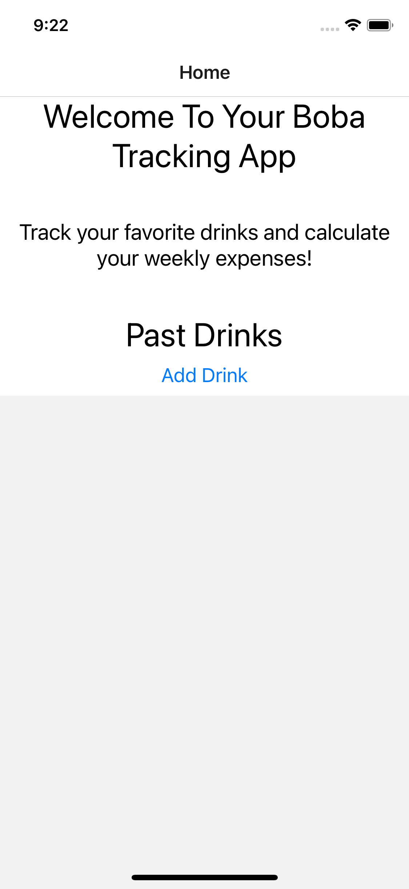
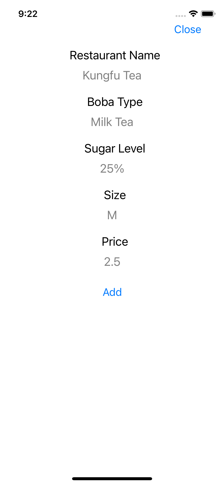
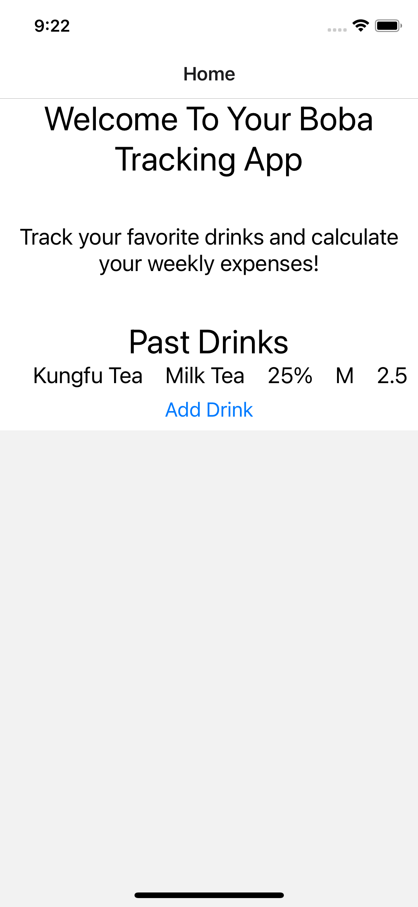

# Hack Technology / Project Attempted

## What you built?

I made a simple Bobatracking app using react native. You can just add your drinks and view your history of all the drinks you've had in the past.

The home page

The add Drinks Page

An example of past drinks

## Who Did What?

I did it myself.

## What you learned

This is the first time I used react native, even though I've done work with react before. I primarily just wanted to see what the difference between React Native and XCode was and which one was simpler to make an ios app. I learned how easy it was to use react native, it is essentially the same as react but with just a few small differences. I thnk if I want to create a mobile app for my final project, I will use react native rather than swift/xcode.

## Authors

Celina

## Acknowledgments

https://github.com/mattfrances/simpleReactNativeTodoList/blob/master/App.js
